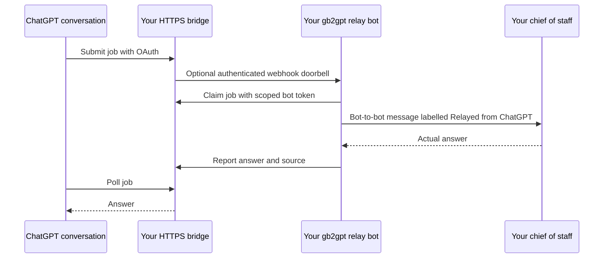

# Self-host gb2gpt with a dedicated relay bot

This guide sets up one person's own ChatGPT connection and Grok Bot relay. Repeat it with separate accounts, hostname, credentials, and database for each person. Do not share the owner's token or expose one instance as a multi-user service: the bridge has one owner and no tenant isolation.

## What talks to what



The relay is a real, separate Grok Bot identity. The bridge's `hub_bot_id` is its routing endpoint, not a claim that the relay is the chief of staff. The relay contacts your existing coordinator internally; only the relay needs a bridge worker credential. ChatGPT still represents requests authorized by you, but the fleet sees the relay as the speaker. This is attribution through trusted bot instructions, not cryptographic proof of who typed a request. Approvals and existing bot permissions still apply.

## Prerequisites

- Python 3.11+ and an always-on Linux host with systemd that you control. Docker for the optional packaged proxy below. Its `--network host` flag works only on Linux, not Docker Desktop for Mac/Windows.
- A domain on Cloudflare and a [Cloudflare Tunnel](https://developers.cloudflare.com/tunnel/setup/) connector already installed as a persistent service on that host. Cloudflare's free plan is enough.

This guide follows one tested stack (systemd + Nginx + Cloudflare Tunnel). If you already have a VPS with Caddy, Nginx, or another TLS reverse proxy, you can skip steps 2–3: apply the proxy requirements from [README → Reachable HTTPS](../README.md#reachable-https), point your hostname at `127.0.0.1:8787`, and continue at step 4. For rate limiting without Cloudflare, see the note in step 2.
- ChatGPT with custom MCP connections/Developer mode available to your account/workspace.
- Cursor Grok Bots with a dedicated bot, secure process secrets, bot-to-bot messaging, and routines/webhooks if you want automatic wake.
- Your existing chief-of-staff bot's real name (the bot that coordinates your others).

Account UIs and eligibility change. If a capability is unavailable, leave that step incomplete; do not replace secure storage with a chat message or disable authentication.

## 1. Create the relay and bridge configuration

Create a new Grok Bot named `gb2gpt`, description “ChatGPT relay for my bot fleet”. Give it [prompts/bot.md](../prompts/bot.md) and [prompts/relay.md](../prompts/relay.md), replacing `REPLACE_WITH_CHIEF_OF_STAFF_NAME` with your actual coordinator. It must report `gb2gpt` during discovery and explain its relay role.

On your Linux host, clone this repository into a private directory under your home, then:

```bash
git clone https://github.com/EdmundLimBoEn/gb2gpt.git
cd gb2gpt
chmod 700 .
cp fleet.relay.example.json fleet.json
```

Edit `fleet.json` before initializing: choose your fleet label and stable `public_url`, for example `https://gb2gpt-<24-random-hex-characters>.your-domain.example`. Generate the suffix with `python3 -c 'import secrets; print(secrets.token_hex(12))'`. Use a single DNS label so Cloudflare's free Universal SSL certificate (which covers only one level of subdomain) covers it. A complex hostname is not authentication.

Keep `id=gb2gpt` and `token_env=BOT_GB2GPT_TOKEN` unless you also update the bot's trusted instructions. Then:

```bash
python3 scripts/init.py
chmod 600 fleet.json   # use 644 instead if you run the bridge in Docker (see README)
mkdir -p data
chmod 700 data
python3 -m unittest discover -s tests -v
python3 scripts/smoke.py
```

The initializer creates `.env` with mode 0600 and random independent credentials, and leaves an existing `.env` untouched. Never print, commit, upload, or paste the file into a conversation. These files and the database are ignored by Git.

| Credential | Where it belongs |
| --- | --- |
| `BRIDGE_TOKEN` | Host `.env`; your bridge OAuth login password field only |
| `OAUTH_CLIENT_SECRET` | Host `.env`; ChatGPT's masked OAuth client-secret setting only |
| `BOT_GB2GPT_TOKEN` | Host `.env`; relay's masked secret card as `GB2GPT_BOT_TOKEN` |
| `BOT_GB2GPT_WEBHOOK_KEY` | Host `.env`; comes from the routine's protected webhook settings |

A bot must never receive the bridge owner token or OAuth client secret. Secret cards are a secure UI, not ordinary conversation text.

## 2. Run persistently behind a limited proxy

Use [deploy/gb2gpt.service.example](../deploy/gb2gpt.service.example). Replace `YOUR_LINUX_USER` and every `/ABSOLUTE/PATH/TO/gb2gpt` with the actual user and absolute checkout path. The service loads `.env` itself, keeps SQLite under `data`, binds only to loopback, and restarts after failure/boot.

```bash
sudo install -m 644 deploy/gb2gpt.service.example /etc/systemd/system/gb2gpt.service
sudo systemctl daemon-reload
sudo systemctl enable --now gb2gpt
curl -fsS http://127.0.0.1:8787/health
```

The sample is for a normal `/home/USER/...` checkout. Adapt `ProtectHome`/`ReadWritePaths` if using another layout. Do not run multiple processes on this database.

The supplied [Nginx configuration](../deploy/nginx.conf) listens only on `127.0.0.1:8788`, forwards to `8787`, preserves OAuth/Origin headers, permits 35-second responses, caps request bodies at 128 KiB, limits requests to 10/second with a burst of 30 and 32 connections per connecting client, and disables request logging. The client key is the `CF-Connecting-IP` header supplied by your tunnel; do not expose this proxy directly or trust that header from arbitrary callers. **Without Cloudflare in front, that header is empty and Nginx applies no limits at all**; replace both `$http_cf_connecting_ip` occurrences with `$binary_remote_addr` (or your proxy's real-client-IP variable). Nginx request error logging is also disabled to keep OAuth queries out of logs; use config validation, container startup diagnostics, and health checks to troubleshoot.

On Linux with Docker:

```bash
docker run -d --name gb2gpt-proxy --restart unless-stopped \
  --network host --read-only \
  --tmpfs /var/cache/nginx --tmpfs /var/run \
  --mount type=bind,src="$(pwd)/deploy/nginx.conf",dst=/etc/nginx/nginx.conf,readonly \
  nginx:stable-alpine
docker exec gb2gpt-proxy nginx -t
curl -fsS http://127.0.0.1:8788/health
```

Use sudo for Docker only if your host requires it. No application secrets enter this image. For repeatable upgrades, record the pulled image digest and use that digest instead of the moving tag. If you already run a rate-limited reverse proxy, reuse it with these limits and paths instead of adding another one.

## 3. Add the hostname to Cloudflare Tunnel

In Cloudflare's tunnel dashboard, add a published application route for your chosen hostname to `http://127.0.0.1:8788`. Create its proxied CNAME to `YOUR_TUNNEL_ID.cfargotunnel.com` if the dashboard did not create it. Keep the existing routes and final catch-all intact. Do not add an interactive Access login in front of MCP; the bridge provides OAuth.

The dashboard route is all you need. The commands below are an optional alternative using Cloudflare's `cf` CLI. Subcommand names may differ between versions, so check `cf --help` first:

```bash
export CLOUDFLARE_ACCOUNT_ID=YOUR_ACCOUNT_ID
cf zero-trust tunnels cloudflared configurations get YOUR_TUNNEL_ID
cf zero-trust tunnels cloudflared configurations update YOUR_TUNNEL_ID \
  --body '{"config":{"ingress":[{"hostname":"YOUR_HOSTNAME","service":"http://127.0.0.1:8788"},{"service":"http_status:404"}]}}' \
  --dry-run
```

The example body is for an otherwise empty tunnel. **An update replaces the whole configuration.** For a shared tunnel, save the current result locally and insert your route before its catch-all, preserving every existing ingress and other config field. After checking the dry run, run the update without `--dry-run`.

```bash
cf dns records create --zone YOUR_DOMAIN --body \
  '{"type":"CNAME","name":"YOUR_HOSTNAME","content":"YOUR_TUNNEL_ID.cfargotunnel.com","proxied":true,"ttl":1}' \
  --dry-run
```

Check for an existing exact DNS record first. Apply without `--dry-run`, then verify:

```bash
curl -fsS https://YOUR_HOSTNAME/health
curl -i https://YOUR_HOSTNAME/mcp
curl -fsS https://YOUR_HOSTNAME/.well-known/oauth-protected-resource
```

Health must return `ok=true`, unauthenticated MCP must return 401, and protected resource metadata must refer to your own HTTPS `/mcp`. Port 8787/8788 must remain loopback-only. Each person uses their own hostname.

## 4. Connect ChatGPT

In the ChatGPT web UI as of September 2026: **Plugins → Add → Create MCP App** (OpenAI renames these menus often; look for adding a custom MCP app/connector). Developer mode may first need enabling under **Settings → Security and login** in other accounts. See the [ChatGPT setup and ritual](../CHATGPT_SETUP.md).

Enter your app name, description, and `https://YOUR_HOSTNAME/mcp`. Select OAuth, expand **Advanced OAuth settings**, and wait for discovery:

- Registration: **User-Defined OAuth Client**.
- Client ID: `gb2gpt`.
- Client secret: your `OAUTH_CLIENT_SECRET` in the masked field.
- Token endpoint auth: **client_secret_basic** (the bridge also supports `client_secret_post`).
- Default scope: `bridge`; base scopes empty. No OIDC, DCR, or CIMD required.
- Callback: copy the exact displayed URL into `fleet.json.oauth_redirect_uris` if it differs from the sample; restart the bridge after editing.

Review the app permission notice, create it, continue to your bridge, and enter `BRIDGE_TOKEN` in the bridge's password field. Verify the login page uses your hostname and the callback points to ChatGPT. Finish **Connect and allow**. Never enter either credential into the ChatGPT composer. OAuth authorizes ChatGPT to create/read jobs and change bridge routing; write-tool approvals still apply.

## 5. Wire the relay worker and wake

Copy `scripts/bot_client.py` onto the relay's cloud computer, using an authenticated checkout or your trusted file transfer. Supply `prompts/bot.md` and the customized relay instructions as trusted routine instructions. You can ask the bot to prepare these; verify its tools actually work rather than accepting a setup claim.

Set the non-secret `GB2GPT_URL` to your HTTPS origin in its runtime configuration. For a shell-based worker, keep a small non-secret file on its cloud computer:

```bash
mkdir -p "$HOME/.config/gb2gpt"
printf '%s\n' 'export GB2GPT_URL=https://YOUR_HOSTNAME' > "$HOME/.config/gb2gpt/env.sh"
```

Every routine run must source `"$HOME/.config/gb2gpt/env.sh"` before invoking the adapter (or set the equivalent environment through the product). Environment set in one interactive shell does not persist into a later routine. Keep `GB2GPT_BOT_TOKEN` out of that file: it comes from secure secret injection. Verify presence without printing its value with `python3 -c 'import os; print("scoped token present:", bool(os.environ.get("GB2GPT_BOT_TOKEN")))'` in a new routine process.

 Have the bot request a masked **secret-request** card for `GB2GPT_BOT_TOKEN`, then copy only `BOT_GB2GPT_TOKEN` from the host `.env` into that card. Confirm the secret reaches **new worker processes** as an environment variable. Do not put it in command arguments, routine text, MCP tool arguments, or a normal message.

With the secret injected, manually ask the relay to run:

```bash
python3 /path/to/bot_client.py list_bots <<'JSON'
{}
JSON
python3 /path/to/bot_client.py claim_job <<'JSON'
{}
JSON
```

`list_bots` must show only your relay and `claim_job` must return an empty queue before testing. Next submit a discovery job from your connected ChatGPT conversation using the ritual. Run the relay manually, claim it, report `hub_bot_id=gb2gpt` and the truthful relay explanation, and let ChatGPT bind it. Never fabricate an answer by reporting it from the deployment host as if the real bot did it.

Then prepare one webhook-only routine using the trusted instructions: ignore the webhook body, claim its own queue, handle at most ten jobs, renew leases while waiting, report actual results, and stop when empty. No time schedule or continuous polling is necessary. Review/enable the routine only after the manual worker path is proven.

Copy the routine's official `POST to` URL into `fleet.json.bots[0].webhook_url`, and set `webhook_key_env` to `BOT_GB2GPT_WEBHOOK_KEY`. Store the sender key only under that name in the host `.env`, copied from its protected webhook settings. Only the official `https://api2.cursor.sh/automations/webhook/ID` shape is currently supported; changed upstream formats require a code update, not bypassing validation. Set `WAKE_ENABLED=true`, restart the bridge, and verify automatic wake. Enabling wake starts bot runs and may consume account usage. A webhook 200 is acceptance, not a completed result.

## Worker networking troubleshooting

The REST adapter identifies itself as `gb2gpt-bot/1.0.0`. This avoids a live Cloudflare 1010 rejection observed for Python urllib's generic default user agent without impersonating a browser or disabling Cloudflare protections. If your bot computer returns only AAAA records but has no usable IPv6, fix its DNS/network environment and rerun the shipped adapter; a one-off curl or pinned edge-IP success is not proof that the routine's normal client works. Preserve TLS hostname/certificate checks, and do not permanently pin Cloudflare's changing edge IPs.

## OAuth browser troubleshooting

If the login POST says “Origin not allowed”, refresh/restart linking after upgrading to this version. The HTML login uses `Referrer-Policy: strict-origin`: it omits URL paths/query parameters from referrers while preserving the origin on native form POSTs. `no-referrer` can make browsers send `Origin: null` for these forms, which the bridge correctly rejects. Do not allow `null` globally or disable the origin/CSRF checks. See [MDN's Origin/referrer-policy behavior](https://developer.mozilla.org/en-US/docs/Web/HTTP/Reference/Headers/Referrer-Policy). JSON endpoints still send `no-referrer`.

## Acceptance and operations

Do not call setup complete until these all work:

- Public health, OAuth metadata and 401 without authentication.
- A real ChatGPT OAuth connection with tools visible.
- Relay can list/claim/report using only its own credential.
- Discovery binds the relay and truthfully distinguishes the coordinator behind it.
- One real request goes ChatGPT → relay → chief of staff → relay → bridge → ChatGPT; replies identify their source.
- A second request uses the same chat routing, and automatic wake works if enabled.
- Native ChatGPT memory is verified separately in its memory controls, if available. The bridge cannot save native memory; product/account restrictions may prevent it.

`systemctl status gb2gpt`, `docker logs gb2gpt-proxy --tail 30`, and Cloudflare tunnel status diagnose host issues. Keep logs private. Jobs/messages and OAuth token hashes persist in plaintext SQLite under `data`; keep that directory private. Back up with SQLite's online backup API or stop the bridge before copying its database. Preserve `.env`, fleet config and data during upgrades; do not run initialization over an existing installation or delete the database to fix auth.

Deploy code updates, restart `gb2gpt`, and recheck health. After editing Nginx, run `nginx -t` and reload it. If changing hostname or credentials, follow the revocation/rotation instructions in the README; old OAuth tokens require explicit revocation and reconnecting. Removing this hostname's exact DNS/ingress route stops remote access but does not erase stored jobs.


## Repeatable end-to-end check

Use an ordinary chat opened from the connected app's **Try in chat** button (on the app's page under Plugins), or any new chat with `gb2gpt` enabled from **+ → Developer mode/tools**. Paste the ritual from `prompts/chatgpt.md` first. Once discovery has succeeded and `bind_hub` has returned your relay, send:

> Use create_job with this chat's conversation_id and a fresh request_id; omit bot_id. Ask my chief of staff through the relay to reply “Relay connection confirmed” and identify the relay. Connectivity check only; no other actions. Show the job ID. Poll get_job with wait_seconds=15 at most three times and display the actual result with its source.

The tool is **create_job**, not `send_message`. The coordinator's name belongs in the message, not `bot_id`, unless that coordinator is actually configured in `fleet.json`. Keep the returned job ID. A queued/running result means check the same job again later; it does not authorize inventing a reply or repeatedly creating jobs. A retry of job creation must reuse the same conversation_id, request_id, and arguments. A new user request gets a new request_id.

Verify all three places: the bridge ledger shows `succeeded`, the native bot exchange shows the real coordinator reply and correlation job ID, and ChatGPT displays the same attributed reply. Repeat with a second fresh request_id in the same chat to prove the bound route is reused. A host-created test can prove the webhook/worker path during a ChatGPT outage, but does not prove ChatGPT submission.

## Diagnose one layer at a time

Run host commands from the checkout directory on Linux. Start with the first failing layer; do not rotate credentials or change DNS until evidence points there.

```bash
systemctl is-active gb2gpt
sudo systemctl status gb2gpt --no-pager
sudo journalctl -u gb2gpt -n 30 --no-pager
curl -fsS --max-time 5 http://127.0.0.1:8787/health
sudo docker exec gb2gpt-proxy nginx -t
curl -fsS --max-time 5 http://127.0.0.1:8788/health
sudo systemctl status cloudflared --no-pager
curl -fsS --max-time 10 https://YOUR_HOSTNAME/health
curl -sS -o /dev/null -w '%{http_code}\n' https://YOUR_HOSTNAME/mcp
```

Expect `active`, two local health successes, a public health success, and MCP `401`. The service logs do not log request bodies; still keep diagnostic output private. Avoid printing `.env`, tunnel tokens, webhook settings, OAuth callback query strings, or claim receipts. Do not enable full proxy request logging to diagnose OAuth.

Read job progress without displaying messages, results, credentials, or claim hashes:

```bash
python3 - <<'PYTHON'
import json, sqlite3, time
from pathlib import Path
uri = Path('data/bridge.sqlite3').resolve().as_uri() + '?mode=ro'
with sqlite3.connect(uri, uri=True) as db:
    db.row_factory = sqlite3.Row
    for row in db.execute("""
        SELECT id, conversation_id, bot_id, kind, status,
               wake_status, wake_count, attempts, lease_until, updated
        FROM jobs ORDER BY created DESC LIMIT 10
    """):
        out = dict(row)
        out['lease_expired'] = bool(out['status'] == 'running' and out['lease_until'] and out['lease_until'] <= time.time())
        print(json.dumps(out))
PYTHON
```

Use the job ID to read its actual result through authenticated `get_job`. Results and messages can contain private information; share only a redacted excerpt when asking for help.

| Symptom or state | Meaning and next action |
| --- | --- |
| Port 8787 health fails | Bridge is down or misconfigured. Inspect systemd exit/error, absolute paths, Linux user, `.env` permissions, config JSON, and writable `data` directory. Fix the reported issue, then `sudo systemctl restart gb2gpt`. |
| 8787 works, 8788 fails | Proxy problem. Run `nginx -t`, inspect container state with `sudo docker ps -a --filter name=gb2gpt-proxy` and its last 30 startup log lines. Check the mount and loopback upstream port. |
| Local health works, public health fails | Tunnel/DNS layer. Check the connector is connected, exact proxied CNAME, and exact ingress hostname/upstream. Inspect existing configuration before updating; preserve other routes. |
| Public MCP returns 401 without auth | Expected. If an authenticated worker gets 401, check its injected scoped token and restart new worker processes after updating the secret. Never try the owner token in a bot. |
| OAuth discovery fails | Check public `/.well-known/oauth-protected-resource` and `/.well-known/oauth-authorization-server`; both must use the same configured HTTPS origin. Remove stale app draft settings by creating/reconnecting the intended app, not by weakening checks. |
| OAuth login says Origin not allowed | Use this version's HTML `strict-origin` policy, start a fresh authorization attempt, and check proxy header handling. Do not accept null/foreign origins. |
| OAuth invalid_client / invalid_grant | Confirm client ID `gb2gpt`, current masked client secret, `client_secret_basic`, exact callback allowlist, and host clock. Restart the linking flow for expired/used authorization codes. |
| ChatGPT says Error in message stream or something went wrong, and no new ledger job exists | Failure occurred before bridge submission. Retry/reload the chat, or open a fresh chat via the connected app's Try in chat. Keep the same request_id for a retry. Do not rotate a working bot token. |
| queued + wake disabled/not_configured | Manual mode or missing webhook configuration. Run the worker manually, or finish the official webhook URL/key and WAKE_ENABLED setup, then restart the bridge. |
| queued + wake rejected | Webhook refused the request. Check the exact routine URL, sender key stored under webhook_key_env, and active routine. Never post secrets in chat to fix it. |
| queued + wake unknown | Network timeout; acceptance is uncertain. Inspect native routine activity before retrying. `wake_job` retries the doorbell only, with the same job ID; cap is five wakes and one per 30 seconds. |
| queued + wake accepted | Upstream accepted the doorbell, but worker has not claimed yet. Check routine activity, trusted instructions, scoped token injection, adapter path, and ordinary hostname connectivity. |
| running | Worker holds a 15-minute lease. Inspect its native transcript/downstream exchange. It must renew while waiting. If it crashes, an expired lease is reclaimable by a later worker run; do not manually rewrite job status. |
| attempts grows or duplicate downstream messages appear | Correlate by job ID. A reclaimed job may repeat work; the coordinator must use that ID for idempotency. Lease ownership does not guarantee exactly-once downstream side effects. |
| waiting | The worker recorded a progress note (for example, delegated to another bot) and released its claim. The final answer lands on the same job when the follow-up reaches the relay, which must `claim_job` with that job ID and report. If it stays waiting, check the relay's native chat for a follow-up quoting the job ID; `updated` shows how long it has waited. Do not rewrite status or create a new request to fetch it. |
| failed | Read the recorded real failure. Fix its cause. A terminal result is immutable; retry the user operation deliberately with a fresh request_id if appropriate. |
| succeeded but ChatGPT shows running/null | ChatGPT has an earlier snapshot. Ask get_job for that same job ID again. Do not create another request just to retrieve a reply. |
| Worker Cloudflare 1010 | Use the shipped adapter's truthful gb2gpt-bot user agent. Check the normal client, not only curl. Preserve Cloudflare security protections. |
| Worker DNS/IPv6 failure | Check resolution and available connectivity on the bot computer. Repair that environment; do not pin changing Cloudflare IPs or disable TLS validation. |
| Claim expired / invalid claim | Old worker must stop. Claim again only after the job is eligible, and use the new receipt privately. Never forge a report from the host. |
| Native memory unavailable | Use the supplied ritual in each new chat. Per-conversation hub state persists in the bridge; that does not save native ChatGPT memory. |

## Back up, upgrade, and recover

Back up all three together: private `.env`, private `fleet.json`, and SQLite. Use a private backup directory outside the checkout and keep backup filenames/contents out of shared logs. The following copies configuration and uses SQLite's online backup API, so WAL contents are included while the service runs:

```bash
python3 - <<'PYTHON'
from datetime import datetime, timezone
from pathlib import Path
import os, shutil, sqlite3
os.umask(0o077)
backup = Path.home() / 'gb2gpt-backups' / datetime.now(timezone.utc).strftime('%Y%m%dT%H%M%S%fZ')
backup.mkdir(parents=True, mode=0o700)
for name in ('.env', 'fleet.json'):
    shutil.copyfile(name, backup / name)
with sqlite3.connect('data/bridge.sqlite3') as source, sqlite3.connect(backup / 'bridge.sqlite3') as target:
    source.backup(target)
print('Private backup completed')
PYTHON
```

Before upgrading, note the current Git commit and make a backup. Replace source/prompts, preserve configuration/data, run the local tests and smoke check, then restart the bridge and repeat health and one real round trip. Refresh the bot's copy of `bot_client.py` and trusted routine instructions too; deploying host code does not update the bot computer automatically.

If an upgrade breaks, restore the prior source revision first and restart; do not roll back the ledger merely because code failed. Restoring a database can discard jobs received since the backup and repeat downstream work. For disaster recovery, stop the service, preserve the current directory privately, restore a matched configuration/database backup into a separate checkout with the documented permissions, point the service there, then start and verify. Never copy a live database file without its WAL or use bulk deletion as a repair.

For credential revocation, follow the README's specific rotation procedure. Changing BRIDGE_TOKEN alone does not revoke already-issued OAuth tokens. Disconnect ChatGPT and revoke its token/code/form records when revocation is intended; preserve job history. Update a rotated bot token in both host and masked bot storage and restart fresh workers. To pause processing, pause the routine and set WAKE_ENABLED=false, then restart the bridge; persisted jobs remain queued. To stop remote access, remove only this instance's exact DNS/ingress route, preserving shared tunnel routes.
